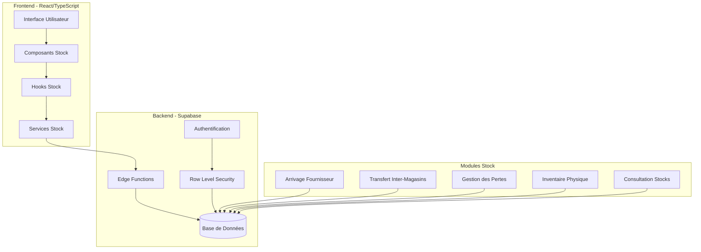

# Design Document - Module Gestion des Stocks

## Overview

Le module de Gestion des Stocks de Sakanaya est conçu comme un système de traçabilité complète des mouvements de marchandises. Il s'intègre parfaitement dans l'architecture existante de l'application en étendant les modèles de données actuels et en ajoutant de nouvelles fonctionnalités spécialisées.

**État actuel de l'implémentation :**
- ✅ **Arrivages simples** : Composant `ArrivalEntry` fonctionnel
- ✅ **Gestion des Pertes** : Composant `LossEntry` avec catégorisation
- ✅ **Consultation des Stocks** : Composant `StockLevelDisplay` avec alertes
- ✅ **Types de base** : Modèles `StockMovement`, `StockLevel`, `Arrival`, `Transfer`
- ❌ **Transferts Inter-Magasins** : Workflow complet manquant
- ❌ **Inventaire Physique** : Non implémenté
- ❌ **Gestion des Fournisseurs** : Non implémenté
- ❌ **Bons de Réception structurés** : Arrivages simplifiés
- ❌ **Validation Directeur** : Workflow d'approbation manquant

Le design suit une approche événementielle où chaque mouvement de stock génère des événements traçables, permettant une reconstruction complète de l'historique et une analyse fine des flux logistiques.

## Architecture

### Architecture Générale



### Intégration avec l'Architecture Existante

Le module s'intègre dans la structure existante :
- **Features** : Nouveau dossier `src/features/stock/`
- **Permissions** : Extension du système RBAC existant
- **Types** : Extension des types existants dans `src/types/`
- **Services** : Nouveaux services utilisant Supabase MCP

## Components and Interfaces

### Structure des Composants

**Structure existante :**
```
src/features/stock/
├── components/
│   ├── ✅ ArrivalEntry.tsx (Arrivages simples)
│   ├── ✅ LossEntry.tsx (Gestion des pertes)
│   ├── ✅ StockLevelDisplay.tsx (Consultation stocks)
│   ├── ✅ StockManagement.tsx (Interface principale)
│   └── ... (autres composants existants)
├── hooks/
│   ├── ✅ useStockLevels.ts
│   └── index.ts
├── services/ (vide - utilise shared/services)
├── ✅ types.ts (Types de base)
└── ✅ index.ts
```

**Extensions nécessaires :**
```
src/features/stock/
├── components/
│   ├── ArrivageFournisseur/
│   │   ├── ❌ SupplierManagement.tsx (Nouveau)
│   │   ├── ❌ BonReceptionForm.tsx (Extension d'ArrivalEntry)
│   │   └── ❌ BonReceptionList.tsx (Nouveau)
│   ├── TransfertStock/
│   │   ├── ❌ TransfertForm.tsx (Nouveau)
│   │   ├── ❌ TransfertList.tsx (Nouveau)
│   │   ├── ❌ ReceptionForm.tsx (Nouveau)
│   │   └── ❌ TransfertStatus.tsx (Nouveau)
│   ├── Inventaire/
│   │   ├── ❌ InventaireForm.tsx (Nouveau)
│   │   ├── ❌ InventaireList.tsx (Nouveau)
│   │   ├── ❌ ComptageSheet.tsx (Nouveau)
│   │   └── ❌ ValidationInventaire.tsx (Nouveau)
│   └── ConsultationStock/
│       ├── ❌ StockDirectorView.tsx (Extension)
│       ├── ❌ StockFilters.tsx (Nouveau)
│       └── ❌ StockHistory.tsx (Nouveau)
├── hooks/
│   ├── ❌ useSuppliers.ts (Nouveau)
│   ├── ❌ useTransferts.ts (Nouveau)
│   ├── ❌ useInventaire.ts (Nouveau)
│   └── ❌ useBonsReception.ts (Nouveau)
├── services/
│   ├── ❌ supplierService.ts (Nouveau)
│   ├── ❌ transfertService.ts (Nouveau)
│   ├── ❌ inventaireService.ts (Nouveau)
│   └── ❌ bonReceptionService.ts (Nouveau)
└── utils/
    ├── ❌ stockCalculations.ts (Nouveau)
    └── ❌ stockValidations.ts (Nouveau)
```

### Interfaces Principales

#### Interface Arrivage Fournisseur

```typescript
interface ArrivageForm {
  fournisseur: Supplier;
  magasinReception: Store;
  dateReception: Date;
  lignesArrivage: LigneArrivage[];
  commentaires?: string;
}

interface ArrivageFormProps {
  onSubmit: (arrivage: ArrivageForm) => Promise<void>;
  suppliers: Supplier[];
  stores: Store[];
  products: Product[];
  loading?: boolean;
}
```

#### Interface Transfert Stock

```typescript
interface TransfertForm {
  magasinSource: Store;
  magasinDestination: Store;
  lignesTransfert: LigneTransfert[];
  commentaires?: string;
}

interface ReceptionForm {
  transfertId: string;
  lignesReception: LigneReception[];
  commentairesReception?: string;
}
```

#### Interface Gestion Pertes

```typescript
interface PerteForm {
  produit: Product;
  quantite: number;
  categorie: PerteCategory;
  commentaire?: string;
  date: Date;
}

interface PerteFormProps {
  onSubmit: (perte: PerteForm) => Promise<void>;
  products: Product[];
  categories: PerteCategory[];
  stockDisponible: Record<string, number>;
}
```

## Data Models

### Modèles de Données Étendus

#### Extension du Modèle Product

```typescript
// Extension du Product existant
interface ProductStock extends Product {
  // Données de stock par magasin
  stockLevels: StockLevel[];
  // Coût moyen pondéré
  averageCost: number;
  // Dernière date d'arrivage
  lastArrivalDate?: Date;
  // Rotation du stock (jours)
  stockRotation?: number;
}

interface StockLevel {
  storeId: string;
  quantity: number;
  reservedQuantity: number; // En transit
  availableQuantity: number; // Disponible à la vente
  lastUpdated: Date;
}
```

#### Nouveaux Modèles Stock

```typescript
// Fournisseurs
interface Supplier {
  id: string;
  name: string;
  contact?: string;
  phone?: string;
  email?: string;
  address?: string;
  isActive: boolean;
  createdAt: Date;
  createdBy: string;
}

// Bon de Réception Fournisseur
interface BonReception {
  id: string;
  numero: string; // Auto-généré
  dateReception: Date;
  supplierId: string;
  supplier: Supplier;
  storeId: string;
  store: Store;
  lignes: LigneReception[];
  totalValue: number;
  status: 'draft' | 'validated';
  createdBy: string;
  createdAt: Date;
  validatedBy?: string;
  validatedAt?: Date;
  commentaires?: string;
}

interface LigneReception {
  id: string;
  bonReceptionId: string;
  productId: string;
  product: Product;
  quantiteRecue: number;
  coutUnitaire: number;
  sousTotal: number;
}

// Transferts Inter-Magasins
interface TransfertStock {
  id: string;
  numero: string; // Auto-généré
  dateCreation: Date;
  storeSourceId: string;
  storeSource: Store;
  storeDestinationId: string;
  storeDestination: Store;
  lignes: LigneTransfert[];
  status: 'en_transit' | 'termine' | 'termine_avec_ecart';
  createdBy: string;
  createdAt: Date;
  receptionneBy?: string;
  receptionneAt?: Date;
  commentaires?: string;
  commentairesReception?: string;
}

interface LigneTransfert {
  id: string;
  transfertId: string;
  productId: string;
  product: Product;
  quantiteEnvoyee: number;
  quantiteRecue?: number;
  ecart?: number;
  commentaire?: string;
}

// Gestion des Pertes
interface Perte {
  id: string;
  date: Date;
  storeId: string;
  store: Store;
  productId: string;
  product: Product;
  quantite: number;
  categorieId: string;
  categorie: PerteCategory;
  valeurPerte: number; // quantite * coût moyen
  commentaire?: string;
  createdBy: string;
  createdAt: Date;
}

interface PerteCategory {
  id: string;
  name: string;
  description?: string;
  color: string; // Pour l'affichage
  isActive: boolean;
  createdBy: string;
  createdAt: Date;
}

// Inventaire Physique
interface Inventaire {
  id: string;
  numero: string; // Auto-généré
  date: Date;
  storeId: string;
  store: Store;
  lignes: LigneInventaire[];
  status: 'en_cours' | 'en_attente_validation' | 'valide';
  totalEcarts: number;
  valeurEcarts: number;
  createdBy: string;
  createdAt: Date;
  validatedBy?: string;
  validatedAt?: Date;
  commentaires?: string;
}

interface LigneInventaire {
  id: string;
  inventaireId: string;
  productId: string;
  product: Product;
  quantiteTheorique: number;
  quantitePhysique?: number;
  ecart?: number;
  valeurEcart?: number;
  commentaire?: string;
}

// Mouvements de Stock (Journal)
interface MouvementStock {
  id: string;
  date: Date;
  type: 'arrivage' | 'transfert_sortie' | 'transfert_entree' | 'vente' | 'perte' | 'ajustement';
  storeId: string;
  store: Store;
  productId: string;
  product: Product;
  quantite: number; // Positif pour entrée, négatif pour sortie
  coutUnitaire?: number;
  valeur?: number;
  referenceId: string; // ID du document source
  referenceType: string; // Type du document source
  createdBy: string;
  createdAt: Date;
  commentaire?: string;
}
```

### Schémas de Base de Données

```sql
-- Extension des tables existantes
ALTER TABLE products ADD COLUMN average_cost DECIMAL(10,2);
ALTER TABLE products ADD COLUMN last_arrival_date TIMESTAMP;
ALTER TABLE products ADD COLUMN stock_rotation INTEGER;

-- Nouvelles tables
CREATE TABLE suppliers (
  id UUID PRIMARY KEY DEFAULT gen_random_uuid(),
  name VARCHAR(255) NOT NULL,
  contact VARCHAR(255),
  phone VARCHAR(50),
  email VARCHAR(255),
  address TEXT,
  is_active BOOLEAN DEFAULT true,
  created_at TIMESTAMP DEFAULT NOW(),
  created_by UUID REFERENCES users(id)
);

CREATE TABLE stock_levels (
  id UUID PRIMARY KEY DEFAULT gen_random_uuid(),
  store_id UUID REFERENCES stores(id),
  product_id UUID REFERENCES products(id),
  quantity DECIMAL(10,3) DEFAULT 0,
  reserved_quantity DECIMAL(10,3) DEFAULT 0,
  available_quantity DECIMAL(10,3) GENERATED ALWAYS AS (quantity - reserved_quantity) STORED,
  last_updated TIMESTAMP DEFAULT NOW(),
  UNIQUE(store_id, product_id)
);

CREATE TABLE bons_reception (
  id UUID PRIMARY KEY DEFAULT gen_random_uuid(),
  numero VARCHAR(50) UNIQUE NOT NULL,
  date_reception DATE NOT NULL,
  supplier_id UUID REFERENCES suppliers(id),
  store_id UUID REFERENCES stores(id),
  total_value DECIMAL(12,2) DEFAULT 0,
  status VARCHAR(20) DEFAULT 'draft',
  created_by UUID REFERENCES users(id),
  created_at TIMESTAMP DEFAULT NOW(),
  validated_by UUID REFERENCES users(id),
  validated_at TIMESTAMP,
  commentaires TEXT
);

CREATE TABLE lignes_reception (
  id UUID PRIMARY KEY DEFAULT gen_random_uuid(),
  bon_reception_id UUID REFERENCES bons_reception(id) ON DELETE CASCADE,
  product_id UUID REFERENCES products(id),
  quantite_recue DECIMAL(10,3) NOT NULL,
  cout_unitaire DECIMAL(10,2) NOT NULL,
  sous_total DECIMAL(12,2) GENERATED ALWAYS AS (quantite_recue * cout_unitaire) STORED
);

-- Tables similaires pour transferts, pertes, inventaires, mouvements
```

## Error Handling

### Stratégie de Gestion d'Erreurs

#### Types d'Erreurs

```typescript
enum StockErrorType {
  INSUFFICIENT_STOCK = 'INSUFFICIENT_STOCK',
  INVALID_QUANTITY = 'INVALID_QUANTITY',
  STORE_NOT_FOUND = 'STORE_NOT_FOUND',
  PRODUCT_NOT_FOUND = 'PRODUCT_NOT_FOUND',
  SUPPLIER_NOT_FOUND = 'SUPPLIER_NOT_FOUND',
  TRANSFER_NOT_FOUND = 'TRANSFER_NOT_FOUND',
  UNAUTHORIZED_OPERATION = 'UNAUTHORIZED_OPERATION',
  VALIDATION_ERROR = 'VALIDATION_ERROR',
  DATABASE_ERROR = 'DATABASE_ERROR',
  NETWORK_ERROR = 'NETWORK_ERROR'
}

interface StockError {
  type: StockErrorType;
  message: string;
  details?: any;
  field?: string;
}
```

#### Gestion des Erreurs par Module

```typescript
// Service d'erreurs centralisé
class StockErrorHandler {
  static handleArrivageError(error: any): StockError {
    if (error.code === '23505') { // Duplicate key
      return {
        type: StockErrorType.VALIDATION_ERROR,
        message: 'Ce numéro de bon de réception existe déjà'
      };
    }
    // Autres cas...
  }

  static handleTransfertError(error: any): StockError {
    if (error.message?.includes('insufficient_stock')) {
      return {
        type: StockErrorType.INSUFFICIENT_STOCK,
        message: 'Stock insuffisant pour effectuer ce transfert'
      };
    }
    // Autres cas...
  }
}
```

#### Validation des Données

```typescript
// Validations métier
class StockValidations {
  static validateArrivage(arrivage: ArrivageForm): StockError[] {
    const errors: StockError[] = [];
    
    if (arrivage.lignesArrivage.length === 0) {
      errors.push({
        type: StockErrorType.VALIDATION_ERROR,
        message: 'Au moins une ligne d\'arrivage est requise',
        field: 'lignesArrivage'
      });
    }
    
    arrivage.lignesArrivage.forEach((ligne, index) => {
      if (ligne.quantiteRecue <= 0) {
        errors.push({
          type: StockErrorType.INVALID_QUANTITY,
          message: `Quantité invalide ligne ${index + 1}`,
          field: `lignesArrivage.${index}.quantiteRecue`
        });
      }
    });
    
    return errors;
  }
}
```

## Testing Strategy

### Stratégie de Tests

#### Tests Unitaires

```typescript
// Tests des services
describe('ArrivageService', () => {
  test('should create arrivage with valid data', async () => {
    const arrivage = createMockArrivage();
    const result = await arrivageService.createArrivage(arrivage);
    expect(result.success).toBe(true);
  });

  test('should reject arrivage with negative quantity', async () => {
    const arrivage = createMockArrivage({ quantite: -10 });
    const result = await arrivageService.createArrivage(arrivage);
    expect(result.success).toBe(false);
    expect(result.error?.type).toBe(StockErrorType.INVALID_QUANTITY);
  });
});

// Tests des hooks
describe('useStock', () => {
  test('should update stock levels after arrivage', async () => {
    const { result } = renderHook(() => useStock('store-1'));
    await act(async () => {
      await result.current.processArrivage(mockArrivage);
    });
    expect(result.current.stockLevels['product-1']).toBeGreaterThan(0);
  });
});
```

#### Tests d'Intégration

```typescript
// Tests des flux complets
describe('Stock Flow Integration', () => {
  test('complete transfer flow', async () => {
    // 1. Créer un transfert
    const transfert = await transfertService.createTransfert(mockTransfert);
    expect(transfert.status).toBe('en_transit');
    
    // 2. Vérifier décrémentation source
    const sourceStock = await stockService.getStockLevel('store-1', 'product-1');
    expect(sourceStock.quantity).toBe(initialQuantity - transferQuantity);
    
    // 3. Réceptionner le transfert
    await transfertService.receiveTransfert(transfert.id, mockReception);
    
    // 4. Vérifier incrémentation destination
    const destStock = await stockService.getStockLevel('store-2', 'product-1');
    expect(destStock.quantity).toBe(transferQuantity);
  });
});
```

#### Tests E2E

```typescript
// Tests Cypress pour les workflows complets
describe('Stock Management E2E', () => {
  it('should complete arrivage workflow', () => {
    cy.login('director');
    cy.visit('/stock/arrivage');
    
    // Remplir le formulaire
    cy.selectSupplier('Fournisseur Test');
    cy.selectStore('Hub Distribution');
    cy.addProductLine('Thon Rouge', 100, 5000);
    
    // Valider
    cy.get('[data-testid="validate-arrivage"]').click();
    
    // Vérifier création
    cy.get('[data-testid="success-message"]').should('be.visible');
    cy.url().should('include', '/stock/arrivage/list');
  });
});
```

### Performance et Optimisation

#### Optimisations Base de Données

```sql
-- Index pour les requêtes fréquentes
CREATE INDEX idx_stock_levels_store_product ON stock_levels(store_id, product_id);
CREATE INDEX idx_mouvements_stock_date ON mouvements_stock(date DESC);
CREATE INDEX idx_mouvements_stock_store_product ON mouvements_stock(store_id, product_id);

-- Vues matérialisées pour les rapports
CREATE MATERIALIZED VIEW stock_summary AS
SELECT 
  s.id as store_id,
  s.name as store_name,
  p.id as product_id,
  p.name as product_name,
  sl.quantity,
  sl.available_quantity,
  p.average_cost,
  (sl.quantity * p.average_cost) as stock_value
FROM stock_levels sl
JOIN stores s ON sl.store_id = s.id
JOIN products p ON sl.product_id = p.id
WHERE sl.quantity > 0;
```

#### Optimisations Frontend

```typescript
// Pagination et virtualisation pour les listes
const StockList = () => {
  const { data, loading, loadMore } = useInfiniteQuery({
    queryKey: ['stock-movements'],
    queryFn: ({ pageParam = 0 }) => stockService.getMovements(pageParam),
    getNextPageParam: (lastPage) => lastPage.nextCursor
  });

  return (
    <VirtualizedList
      items={data?.pages.flatMap(page => page.items) || []}
      renderItem={({ item }) => <StockMovementItem movement={item} />}
      loading={loading}
      onLoadMore={loadMore}
    />
  );
};

// Cache optimisé pour les niveaux de stock
const useStockLevels = (storeId: string) => {
  return useQuery({
    queryKey: ['stock-levels', storeId],
    queryFn: () => stockService.getStockLevels(storeId),
    staleTime: 5 * 60 * 1000, // 5 minutes
    cacheTime: 10 * 60 * 1000, // 10 minutes
    refetchOnWindowFocus: false
  });
};
```

### Sécurité et Permissions

#### Row Level Security (RLS)

```sql
-- Politique pour stock_levels
CREATE POLICY stock_levels_select ON stock_levels
FOR SELECT USING (
  -- Directeur : accès à tous les magasins
  (auth.jwt() ->> 'role' = 'director') OR
  -- Manager : accès à son magasin uniquement
  (auth.jwt() ->> 'role' = 'manager' AND store_id = (auth.jwt() ->> 'store_id')::uuid)
);

-- Politique pour mouvements_stock
CREATE POLICY mouvements_stock_insert ON mouvements_stock
FOR INSERT WITH CHECK (
  -- Seuls les utilisateurs authentifiés peuvent créer des mouvements
  auth.uid() IS NOT NULL AND
  created_by = auth.uid()
);
```

#### Validation des Permissions

```typescript
// Middleware de validation des permissions
const validateStockPermission = (operation: string, storeId?: string) => {
  return (req: Request, res: Response, next: NextFunction) => {
    const user = req.user;
    
    if (user.role === 'director') {
      return next(); // Directeur a tous les droits
    }
    
    if (user.role === 'manager') {
      if (operation === 'read' && (!storeId || storeId === user.storeId)) {
        return next(); // Manager peut lire son magasin
      }
      if (operation === 'write' && storeId === user.storeId) {
        return next(); // Manager peut modifier son magasin
      }
    }
    
    return res.status(403).json({ error: 'Permission denied' });
  };
};
```

Ce design document fournit une base solide pour l'implémentation du module de Gestion des Stocks, en s'appuyant sur l'architecture existante de Sakanaya tout en ajoutant les fonctionnalités spécialisées nécessaires pour un contrôle logistique complet.